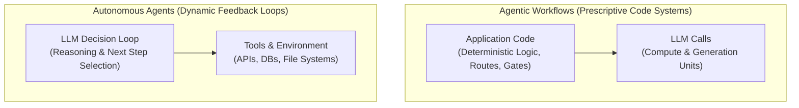
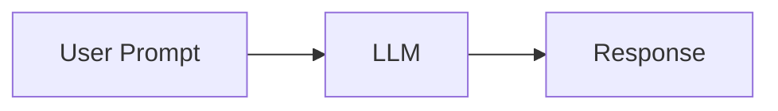
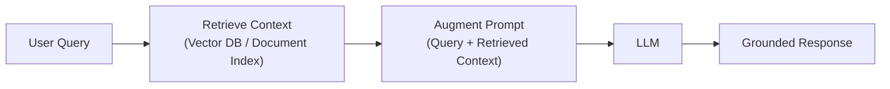
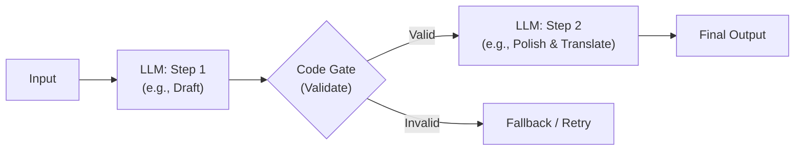
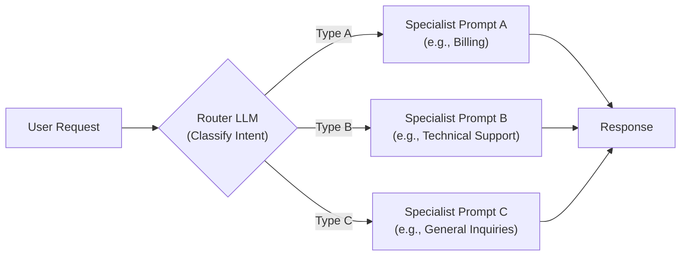
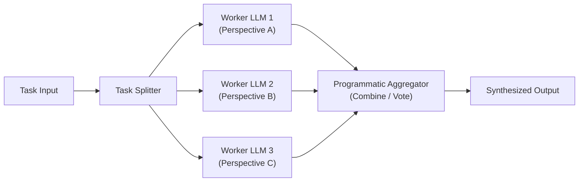
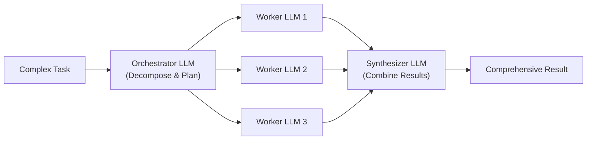
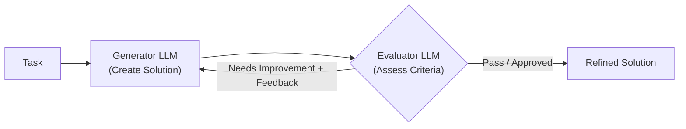
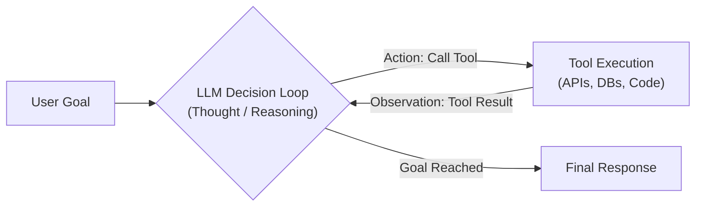

# Agent Patterns

An educational repository created for the **AI group in Tech 2** to explore, learn, and demonstrate modern AI architectural patterns in Java using [Spring AI](https://spring.io/projects/spring-ai) and [Spring Boot](https://spring.io/projects/spring-boot).

---

## Purpose & Conceptual Overview: Chat vs. RAG vs. Workflows vs. Agents

The goal of this repository is to serve as a hands-on learning and presentation resource for the **AI group in Tech 2**. In enterprise software development, terms like *RAG*, *Agentic Workflows*, and *Autonomous Agents* are frequently used interchangeably. However, they represent fundamentally different architectural paradigms with distinct trade-offs in predictability, control, latency, and cost.

This conceptual overview is modeled on the architectural taxonomy established by Anthropic's research on [Building Effective Agents](https://www.anthropic.com/research/building-effective-agents) and Spring AI's engineering guide on [Spring AI Agentic Patterns](https://spring.io/blog/2025/01/21/spring-ai-agentic-patterns).

---

### The Fundamental Architectural Divide: Workflows vs. Agents

The most critical architectural question to ask when designing LLM applications is: **Where does the control flow live?**



1. **Agentic Workflows**: Systems where the sequence of steps, decision branching, and validation gates are hardcoded in **application code**. The LLM is used as an intelligent compute unit within discrete steps (e.g. classification, drafting, parsing).
   - *Strengths*: Highly predictable, reproducible, testable with standard unit tests, low token overhead, easy to debug.
   - *Best for*: Structured business operations, compliance pipelines, and well-defined multi-step tasks.

2. **Autonomous Agents**: Systems where the **LLM itself directs its own process and tool usage**. Given a goal, the model iterates through a dynamic loop—evaluating observations, deciding whether to call another tool, and determining when the objective is met.
   - *Strengths*: Flexible, open-ended problem solving, adaptable to unknown environments and branching paths.
   - *Best for*: Research tasks, exploratory code editing, iterative troubleshooting, and conversational assistants with diverse capabilities.

---

### Conceptual Architecture of Core Patterns

The following conceptual diagrams depict the foundational patterns described in the Spring AI and Anthropic architectural catalog, independent of any specific domain or storage mechanism.

#### 1. Direct Prompting / Augmented LLM
The baseline pattern: a single stateless exchange between user prompt and model weights, optionally enhanced with fixed system instructions.


- **When to use**: Quick Q&A, open-ended ideation, single-step content creation where no external factual grounding or actions are required.

---

#### 2. RAG (Retrieval-Augmented Generation)
Deterministic application code queries an external knowledge store (vector database, full-text index, or document repository) and injects the retrieved context directly into the prompt before the model runs.


- **When to use**: Answering questions based on proprietary knowledge, company policies, or dynamic datasets that cannot be embedded into model weights.
- **Key distinction**: The LLM does *not* query the database; application code unconditionally retrieves facts and feeds them to the LLM.

---

#### 3. Prompt Chaining (Chain Workflow)
Decomposes a complex task into a sequence of smaller, focused LLM calls where the output of each step becomes the input to the next. Application code can insert deterministic programmatic checks (validation gates) between steps.


- **When to use**: Tasks with sequential dependencies where dividing the problem into focused steps trades slight latency for significantly higher quality and reliability.

---

#### 4. Routing Workflow
An initial LLM call acts as a router/classifier to determine the nature of the input, then directs execution to specialized prompts, downstream workflows, or deterministic handlers.


- **When to use**: Complex systems serving diverse input types where specialized prompts and tailored context windows outperform a single bloated "jack-of-all-trades" prompt.

---

#### 5. Parallelization Workflow
Running multiple LLM operations concurrently and combining their outputs programmatically. Anthropic and Spring AI identify two primary variations:
1. **Sectioning**: Splitting a large task into independent subtasks executed in parallel.
2. **Voting / Consensus**: Running the same prompt multiple times (or across different models) to evaluate consensus, guardrail safety, or multiple perspectives.


- **When to use**: Bulk processing of independent documents, multi-perspective reviews, safety guardrails, or when high throughput is required.

---

#### 6. Orchestrator-Workers Workflow
A central orchestrator LLM dynamically analyzes a complex task, determines which subtasks need to be generated, delegates them to worker LLMs, and synthesizes the final result.


- **When to use**: Complex tasks where the required subtasks cannot be predicted upfront by code (e.g., software engineering multi-file refactoring, writing an entire report from ambiguous research).

> **💡 The Coffee Shop Analogy: Parallelization vs. Orchestrator-Workers**
>
> When explaining this to teams, the **coffee shop / barista analogy** makes the distinction immediately intuitive:
>
> | Aspect | **Parallelization Workflow** | **Orchestrator-Workers Workflow** |
> |---|---|---|
> | **Who decides what to do?** | **Application Code** (deterministic task list) | **Orchestrator LLM** (dynamic plan based on input) |
> | **The Barista Analogy** | **2 baristas working the espresso bar simultaneously.**<br/>The queue of drinks is already known (`latte`, `cappuccino`). Barista 1 makes drink A while Barista 2 makes drink B—they perform the **same kind of work in parallel**. Or, 3 baristas taste-test the same roast to vote on flavor notes. | **A Head Barista receiving an open-ended catering order.**<br/>*"I need a morning kickoff breakfast for 8 people with vegan and gluten-free needs."* The Head Barista decomposes the order on the fly: delegating **coffee prep** to Barista 1, **curating gluten-free sandwiches** to Barista 2, and **packing pastries** to Barista 3, then assembling the final breakfast package. |
> | **Nature of subtasks** | Homogeneous / independent pieces of work split by code. | Heterogeneous / different specialized subtasks invented on the fly by an LLM planner. |

---

#### 7. Evaluator-Optimizer Workflow
An iterative refinement loop involving two roles: a **Generator** producing a candidate solution, and an **Evaluator** critiquing the output against specific criteria and providing feedback until quality standards are met or maximum iterations are reached.


- **When to use**: Tasks where evaluation criteria are clear and measurable (e.g., generating code that must pass a test suite, strict style compliance, or complex translation).

---

#### 8. Autonomous Agent (ReAct / Tool-Calling Loop)
The model is placed in an interactive environment equipped with tools (APIs, file access, web queries). Given an objective, the LLM enters an autonomous loop: reasoning about its state, selecting a tool, observing tool output, and repeating until it decides the goal is accomplished.


- **When to use**: Open-ended problem spaces where the sequence of steps cannot be predetermined, and the system must dynamically adapt to intermediate findings.

---

### Conceptual Comparison Matrix

| Pattern | Control of Flow | Predictability | Latency & Token Cost | Best Used For |
|---|---|---|---|---|
| **Simple Prompting** | Caller (1:1) | High | Minimal (1 call) | General text generation, translation, Q&A. |
| **RAG** | Application Code | High | Low (1 retrieval + 1 call) | Grounding responses on proprietary/external data. |
| **Prompt Chaining** | Application Code | High | Predictable ($N$ calls) | Step-by-step transformations with validation. |
| **Routing** | Application Code | High | Low (1 router + 1 specialist) | Directing diverse requests to specialized handlers. |
| **Parallelization** | Application Code | High | Medium (Concurrent $N$ calls) | High-throughput batching, multi-perspective synthesis. |
| **Orchestrator-Workers** | Orchestrator LLM + Code | Medium | High (Variable worker calls) | Complex tasks with unpredictable subtask decomposition. |
| **Evaluator-Optimizer** | Code + Feedback Loop | Medium | Medium-to-High (Iterative calls) | Code generation, iterative proofreading, critique loops. |
| **Autonomous Agent** | LLM (via Tool Calling) | Low-to-Medium | High (Unbounded loop without guards) | Open-ended exploration, autonomous troubleshooting, assistants. |

---

## Patterns Demonstrated in this Repo

To make these architectural concepts tangible for the Tech 2 AI group, this repository provides runnable Java implementations of the progression:

1. **Deterministic Baseline** (`baseline`): File I/O without any LLM.
2. **Workflow: Routing + Prompt Chaining** (`workflow`): A router LLM classifies intent (`chat`, `read`, `write`), and the `write` branch executes a deterministic 2-step prompt chain (`Draft` $\rightarrow$ `Refine`) before writing to [file.txt](file.txt).
3. **Autonomous Agent** (`agent`): The LLM is provided with file I/O tools ([FileTools.java](app/src/main/java/com/agentpatterns/agent/FileTools.java)) and a knowledge search tool ([KnowledgeTools.java](app/src/main/java/com/agentpatterns/agent/KnowledgeTools.java)), autonomously deciding whether and when to invoke them.
4. **Classic RAG** (`rag`): Code deterministically queries an in-memory database ([InMemoryDocumentStore.java](app/src/main/java/com/agentpatterns/rag/InMemoryDocumentStore.java)) of Chuck Norris facts and injects them into the prompt.

| Pattern | Argument | Description | LLM Autonomy |
|---|---|---|---|
| **Interactive Menu** | *(none)* | Interactive CLI selector prompting you to choose a pattern (`1`, `2`, `3`, `4`). | N/A |
| **Baseline** | `baseline` | Deterministic file I/O with hardcoded commands (`read`, `write <text>`). Control benchmark. | None |
| **Chain Workflow** | `workflow` | Fixed multi-step LLM pipeline with routing (intent classification), drafting, and proofreading. | Low (Sequence is code-defined) |
| **Agent** | `agent` | Autonomous agent with tool calling ([FileTools.java](app/src/main/java/com/agentpatterns/agent/FileTools.java) and [KnowledgeTools.java](app/src/main/java/com/agentpatterns/agent/KnowledgeTools.java)). Decides when and how to read/write files or search Chuck Norris jokes. | High (Model controls control flow) |
| **RAG** | `rag` | Classic Retrieval-Augmented Generation using an in-memory Chuck Norris jokes database ([InMemoryDocumentStore.java](app/src/main/java/com/agentpatterns/rag/InMemoryDocumentStore.java)). Code controls retrieval. | Low (Code retrieves & augments prompt) |

---

## Prerequisites

- **Java 21** or later (configured via Gradle toolchain)
- **Azure OpenAI** resource with a deployed chat model (e.g., `gpt-4o` or `gpt-4.1`)
- Operating System: macOS, Linux, or Windows

---

## Setup & Configuration

### 1. Configure Credentials

The application uses environment variables to supply Azure OpenAI credentials. Copy the sample environment file:

```bash
cp .env.example .env
```

Open `.env` and fill in your Azure OpenAI details:

```properties
SPRING_AI_AZURE_OPENAI_API_KEY=your-api-key-here
SPRING_AI_AZURE_OPENAI_ENDPOINT=https://<your-resource-name>.openai.azure.com/
SPRING_AI_AZURE_OPENAI_CHAT_OPTIONS_DEPLOYMENT_NAME=gpt-4o
```

> **Note on Environment Variables:**
> The property names use the `SPRING_AI_*` prefix to bind directly to Spring Boot properties and avoid being shadowed by global shell exports from other projects.

---

## Running the Application

### Option A: Using VS Code (Recommended)

A preconfigured debug configuration is provided in [.vscode/launch.json](.vscode/launch.json). It automatically injects credentials from your local `.env` file into the debug process.

1. Open the **Run and Debug** view in VS Code (`Ctrl+Shift+D` or `Cmd+Shift+D`).
2. Ensure **Debug App** is selected and press `F5` (or click the green **Play** button).
3. The interactive menu will prompt you in the Integrated Terminal:
   ```text
   Select a pattern to run (type 'exit' to quit):
     1) baseline - Deterministic file I/O (no LLM)
     2) workflow - Routing + Prompt Chaining
     3) agent    - Autonomous agent with file & search tools
     4) rag      - Retrieval-Augmented Generation (in-memory DB)
   > 
   ```
4. Enter `1`, `2`, `3`, `4` (or the pattern name) to begin interacting.

---

### Option B: Using the Terminal (Gradle)

#### 1. Export Environment Variables

**macOS / Linux:**
```bash
set -a && source .env && set +a
```

**Windows (PowerShell):**
```powershell
Get-Content .env | ForEach-Object {
  if ($_ -match '^([^=]+)=(.*)$') {
    [System.Environment]::SetEnvironmentVariable($matches[1], $matches[2])
  }
}
```

#### 2. Run the Application

Use `./gradlew bootRun` with `-q --console=plain` to preserve clean terminal stdin/stdout interactivity:

- **Run with Interactive Menu:**
  ```bash
  ./gradlew bootRun -q --console=plain
  ```

- **Run Baseline Pattern Directly:**
  ```bash
  ./gradlew bootRun -q --console=plain --args="baseline"
  ```

- **Run Workflow Pattern:**
  ```bash
  ./gradlew bootRun -q --console=plain --args="workflow"
  ```

- **Run Agent Pattern:**
  ```bash
  ./gradlew bootRun -q --console=plain --args="agent"
  ```

- **Run RAG Pattern:**
  ```bash
  ./gradlew bootRun -q --console=plain --args="rag"
  ```

---

## Pattern Details & Usage Examples

### 1. Baseline Pattern (`baseline`)
Code: [app/src/main/java/com/agentpatterns/baseline/BaselinePattern.java](app/src/main/java/com/agentpatterns/baseline/BaselinePattern.java)

A pure Java baseline without any LLM interactions.
- Commands:
  - `read` - Displays the contents of [file.txt](file.txt).
  - `write <text>` - Overwrites [file.txt](file.txt) with the provided text.
  - `exit` - Quits the pattern loop.

### 2. Workflow Pattern (`workflow`)
Code: [app/src/main/java/com/agentpatterns/workflow/ChainWorkflowPattern.java](app/src/main/java/com/agentpatterns/workflow/ChainWorkflowPattern.java)

Combines **Routing** with **Prompt Chaining**:
1. **Router (Intent Classifier)**: An initial LLM call evaluates the user input and classifies it into `chat`, `read`, or `write`.
2. **Workflow Dispatching**:
   - `chat`: Dispatches to a quick conversational reply sub-workflow.
   - `read`: Reads [file.txt](file.txt) and uses an LLM to read back/summarize the content.
   - `write` (**Prompt Chaining Pipeline**):
     - Reads current [file.txt](file.txt) content.
     - **Step 1 (Drafting)**: LLM drafts new content based on user instructions.
     - **Step 2 (Refining)**: LLM proofreads and polishes the draft, returning a structured `FileUpdate` entity containing updated content and a friendly response.
     - Application code deterministically writes updated content to [file.txt](file.txt).

### 3. Agent Pattern (`agent`)
Code: [app/src/main/java/com/agentpatterns/agent/AgentPattern.java](app/src/main/java/com/agentpatterns/agent/AgentPattern.java), [app/src/main/java/com/agentpatterns/agent/FileTools.java](app/src/main/java/com/agentpatterns/agent/FileTools.java), and [app/src/main/java/com/agentpatterns/agent/KnowledgeTools.java](app/src/main/java/com/agentpatterns/agent/KnowledgeTools.java)

Implements an autonomous agent using Spring AI's tool/function calling:
- Tools provided:
  - `readFile()`: Reads the content of [file.txt](file.txt).
  - `writeFile(content)`: Updates [file.txt](file.txt) with new content.
  - `searchKnowledgeBase(query)`: Queries the in-memory Chuck Norris jokes database.
- The LLM dynamically decides whether to invoke tools, which tools to call, and what arguments to supply based on the user's prompt (e.g., *"Find a Chuck Norris joke about compilers and write it into file.txt"*).

### 4. RAG Pattern (`rag`)
Code: [app/src/main/java/com/agentpatterns/rag/RagPattern.java](app/src/main/java/com/agentpatterns/rag/RagPattern.java) and [app/src/main/java/com/agentpatterns/rag/InMemoryDocumentStore.java](app/src/main/java/com/agentpatterns/rag/InMemoryDocumentStore.java)

Classic Retrieval-Augmented Generation where application code controls the flow:
1. **Retrieve**: Java code performs keyword/token search against the in-memory database of Chuck Norris jokes and facts.
2. **Augment**: The application injects the retrieved excerpts directly into the LLM prompt.
3. **Generate**: The LLM synthesizes an answer strictly grounded on the retrieved context without hallucinating external facts.

> **Key Learning Contrast:**
> - In **RAG** (`rag`), *Java code* unconditionally queries the database and augments the prompt before the model runs.
> - In **Agent** (`agent`), the *model itself* decides if and when to call `searchKnowledgeBase` via tool execution based on the conversation context.

---

## Build & Test

- **Run Tests:**
  ```bash
  ./gradlew test
  ```
- **Build Application:**
  ```bash
  ./gradlew build
  ```

---

## Project Structure

```text
agent_patterns/
├── .env.example                                      # Environment template for Azure credentials
├── .vscode/
│   └── launch.json                                   # Preconfigured VS Code debug profile (loads .env)
├── app/
│   ├── build.gradle                                  # Gradle build config with Spring Boot & Spring AI
│   └── src/
│       ├── main/
│       │   ├── java/com/agentpatterns/
│       │   │   ├── App.java                          # Spring Boot entry point & CLI router
│       │   │   ├── Pattern.java                      # Common pattern interface
│       │   │   ├── agent/
│       │   │   │   ├── AgentPattern.java             # Autonomous agent with tools
│       │   │   │   ├── FileTools.java                # Spring AI @Tool definitions (file I/O)
│       │   │   │   └── KnowledgeTools.java           # Spring AI @Tool definitions (knowledge search)
│       │   │   ├── baseline/
│       │   │   │   └── BaselinePattern.java          # Deterministic baseline
│       │   │   ├── rag/
│       │   │   │   ├── InMemoryDocumentStore.java    # In-memory document DB with token/keyword search
│       │   │   │   └── RagPattern.java               # Classic RAG pattern (retrieve -> augment -> generate)
│       │   │   └── workflow/
│       │   │       └── ChainWorkflowPattern.java     # Multi-step chain workflow
│       │   └── resources/
│       │       └── application.properties            # Spring application configuration
│       └── test/
│           └── java/com/agentpatterns/
│               ├── AppTest.java                      # Smoke tests for App & CLI menu
│               └── rag/
│                   └── InMemoryDocumentStoreTest.java # Tests for keyword search and ranking
├── file.txt                                          # Working file manipulated by the patterns
└── gradle/
    └── libs.versions.toml                            # Version catalog (Spring Boot, Spring AI)
```

---

## Troubleshooting & Common Pitfalls

- **Azure Endpoint Format**:
  Use the classic resource endpoint (`https://<resource-name>.openai.azure.com/`), not the Azure AI Foundry project endpoint (`*.services.ai.azure.com/openai/v1`). The Azure Java client wraps the classic API surface.
- **Gradle Daemon Environment Caching**:
  Gradle daemons cache environment variables from when they were launched. If you modify `.env`, stop running daemons so the changes take effect:
  ```bash
  ./gradlew --stop
  ```
- **Stray Shell Environment Variables**:
  If you encounter `401 Unauthorized` errors, check whether your shell exports conflicting variables:
  ```bash
  env | grep -iE "^(SPRING|AZURE|OPENAI)"
  ```
  This project uses `SPRING_AI_AZURE_OPENAI_*` variables in `.env` so they take precedence.
