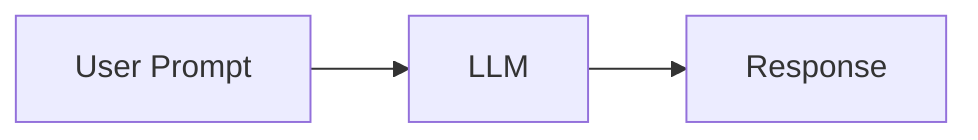
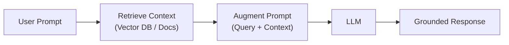
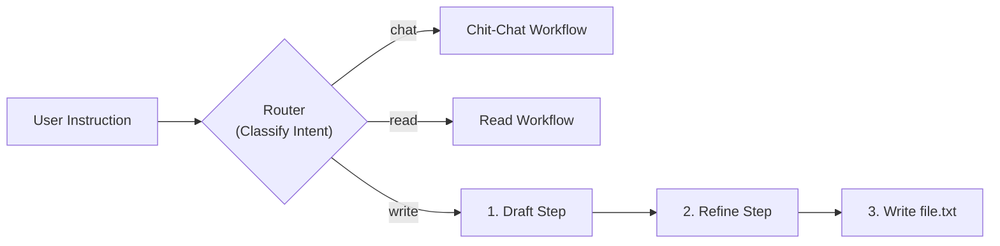
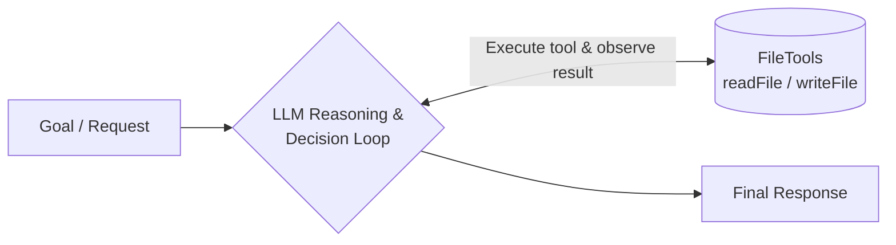

# Agent Patterns

An educational repository created for the **AI group in Tech 2** to explore, learn, and demonstrate modern AI architectural patterns in Java using [Spring AI](https://spring.io/projects/spring-ai) and [Spring Boot](https://spring.io/projects/spring-boot).

---

## Purpose & Conceptual Overview: Chat vs. RAG vs. Workflows vs. Agents

The goal of this repository is to serve as a hands-on learning and presentation resource for the Tech 2 AI group. In the rapidly evolving AI landscape, terms like *RAG*, *Agentic Workflows*, and *Autonomous Agents* are often conflated. This project provides concrete, runnable code examples that contrast where the control flow lives—in deterministic application code vs. inside the LLM's own decision loop.

### How the Concepts Differ

#### 1. Direct Chat / Prompting
Simple text generation with no tools or external grounding.



#### 2. RAG (Retrieval-Augmented Generation)
Deterministic retrieval of relevant documents before querying the LLM to ground the answer.



#### 3. Agentic Workflow (Routing + Prompt Chaining)
A router classifies user intent and dispatches execution to dedicated downstream workflows. When editing, a multi-step prompt chain executes in a deterministic sequence.



#### 4. Autonomous Agent (Tool-Calling / ReAct Loop)
The model dynamically decides if, when, and how to invoke tools based on intermediate observations.



| Concept | What It Does | Who Controls Flow? | Example Use Cases |
|---|---|---|---|
| **Simple Chat / Prompting** | Direct text-in, text-out generation using model weights. No tools, no external context. | Caller | Brainstorming, drafting text, simple Q&A. |
| **RAG (Retrieval-Augmented Generation)** | Enhances prompts with relevant external documents (e.g. vector search or database queries) before asking the model. Read-only grounding without tool execution. | **Deterministic Code** (fetch -> augment prompt -> call LLM) | Documentation assistants, internal knowledge base Q&A, enterprise search. |
| **Agentic Workflows (e.g., Prompt Chaining, Routing)** | Deterministic multi-step pipelines where code orchestrates multiple LLM calls with fixed logic (e.g., intent classifier -> draft -> proofread). | **Application Code** (predictable, reliable, structured) | Strict business workflows, structured data extraction, multi-stage review pipelines. |
| **Autonomous Agents (Tool-Calling / ReAct)** | An LLM given tools/APIs that iteratively decides *if*, *when*, *which*, and *how many* tools to invoke to reach a goal. | **The LLM** (dynamic feedback loop based on observation) | Open-ended tasks, exploratory coding/file manipulation, automated troubleshooting. |

Inspired by Anthropic's [Building Effective Agents](https://www.anthropic.com/research/building-effective-agents) and the [Spring AI Agentic Patterns guide](https://spring.io/blog/2025/01/21/spring-ai-agentic-patterns), this repository demonstrates this progression by having different paradigms solve the same concrete problem: reading and updating [file.txt](file.txt).

---

## Patterns Demonstrated in this Repo

| Pattern | Argument | Description | LLM Autonomy |
|---|---|---|---|
| **Interactive Menu** | *(none)* | Interactive CLI selector prompting you to choose a pattern (`1`, `2`, `3`). | N/A |
| **Baseline** | `baseline` | Deterministic file I/O with hardcoded commands (`read`, `write <text>`). Control benchmark. | None |
| **Chain Workflow** | `workflow` | Fixed multi-step LLM pipeline with routing (intent classification), drafting, and proofreading. | Low (Sequence is code-defined) |
| **Agent** | `agent` | Autonomous agent with tool calling ([FileTools.java](app/src/main/java/com/agentpatterns/agent/FileTools.java)). Decides when and how to read or write. | High (Model controls control flow) |

---

## Prerequisites

- **Java 21** or later (configured via Gradle toolchain)
- **Azure OpenAI** resource with a deployed chat model (e.g., `gpt-4o` or `gpt-4.1`)
- Operating System: macOS, Linux, or Windows

---

## Setup & Configuration

### 1. Configure Credentials

The application uses environment variables to supply Azure OpenAI credentials. Copy the sample environment file:

```bash
cp .env.example .env
```

Open `.env` and fill in your Azure OpenAI details:

```properties
SPRING_AI_AZURE_OPENAI_API_KEY=your-api-key-here
SPRING_AI_AZURE_OPENAI_ENDPOINT=https://<your-resource-name>.openai.azure.com/
SPRING_AI_AZURE_OPENAI_CHAT_OPTIONS_DEPLOYMENT_NAME=gpt-4o
```

> **Note on Environment Variables:**
> The property names use the `SPRING_AI_*` prefix to bind directly to Spring Boot properties and avoid being shadowed by global shell exports from other projects.

---

## Running the Application

### Option A: Using VS Code (Recommended)

A preconfigured debug configuration is provided in [.vscode/launch.json](.vscode/launch.json). It automatically injects credentials from your local `.env` file into the debug process.

1. Open the **Run and Debug** view in VS Code (`Ctrl+Shift+D` or `Cmd+Shift+D`).
2. Ensure **Debug App** is selected and press `F5` (or click the green **Play** button).
3. The interactive menu will prompt you in the Integrated Terminal:
   ```text
   Select a pattern to run (type 'exit' to quit):
     1) baseline - Deterministic file I/O (no LLM)
     2) workflow - Routing + Prompt Chaining
     3) agent    - Autonomous tool-calling agent
   > 
   ```
4. Enter `1`, `2`, `3` (or the pattern name) to begin interacting.

---

### Option B: Using the Terminal (Gradle)

#### 1. Export Environment Variables

**macOS / Linux:**
```bash
set -a && source .env && set +a
```

**Windows (PowerShell):**
```powershell
Get-Content .env | ForEach-Object {
  if ($_ -match '^([^=]+)=(.*)$') {
    [System.Environment]::SetEnvironmentVariable($matches[1], $matches[2])
  }
}
```

#### 2. Run the Application

Use `./gradlew bootRun` with `-q --console=plain` to preserve clean terminal stdin/stdout interactivity:

- **Run with Interactive Menu:**
  ```bash
  ./gradlew bootRun -q --console=plain
  ```

- **Run Baseline Pattern Directly:**
  ```bash
  ./gradlew bootRun -q --console=plain --args="baseline"
  ```

- **Run Workflow Pattern:**
  ```bash
  ./gradlew bootRun -q --console=plain --args="workflow"
  ```

- **Run Agent Pattern:**
  ```bash
  ./gradlew bootRun -q --console=plain --args="agent"
  ```

---

## Pattern Details & Usage Examples

### 1. Baseline Pattern (`baseline`)
Code: [app/src/main/java/com/agentpatterns/baseline/BaselinePattern.java](app/src/main/java/com/agentpatterns/baseline/BaselinePattern.java)

A pure Java baseline without any LLM interactions.
- Commands:
  - `read` - Displays the contents of [file.txt](file.txt).
  - `write <text>` - Overwrites [file.txt](file.txt) with the provided text.
  - `exit` - Quits the pattern loop.

### 2. Workflow Pattern (`workflow`)
Code: [app/src/main/java/com/agentpatterns/workflow/ChainWorkflowPattern.java](app/src/main/java/com/agentpatterns/workflow/ChainWorkflowPattern.java)

Combines **Routing** with **Prompt Chaining**:
1. **Router (Intent Classifier)**: An initial LLM call evaluates the user input and classifies it into `chat`, `read`, or `write`.
2. **Workflow Dispatching**:
   - `chat`: Dispatches to a quick conversational reply sub-workflow.
   - `read`: Reads [file.txt](file.txt) and uses an LLM to read back/summarize the content.
   - `write` (**Prompt Chaining Pipeline**):
     - Reads current [file.txt](file.txt) content.
     - **Step 1 (Drafting)**: LLM drafts new content based on user instructions.
     - **Step 2 (Refining)**: LLM proofreads and polishes the draft, returning a structured `FileUpdate` entity containing updated content and a friendly response.
     - Application code deterministically writes updated content to [file.txt](file.txt).

### 3. Agent Pattern (`agent`)
Code: [app/src/main/java/com/agentpatterns/agent/AgentPattern.java](app/src/main/java/com/agentpatterns/agent/AgentPattern.java) and [app/src/main/java/com/agentpatterns/agent/FileTools.java](app/src/main/java/com/agentpatterns/agent/FileTools.java)

Implements an autonomous agent using Spring AI's tool/function calling:
- Tools provided:
  - `readFile()`: Reads the content of [file.txt](file.txt).
  - `writeFile(content)`: Updates [file.txt](file.txt) with new content.
- The LLM dynamically decides whether to invoke tools, which tools to call, and what arguments to supply based on the user's prompt (e.g., *"Summarize the poem in file.txt and append a concluding verse"*).

---

## Build & Test

- **Run Tests:**
  ```bash
  ./gradlew test
  ```
- **Build Application:**
  ```bash
  ./gradlew build
  ```

---

## Project Structure

```text
agent_patterns/
├── .env.example                                      # Environment template for Azure credentials
├── .vscode/
│   └── launch.json                                   # Preconfigured VS Code debug profile (loads .env)
├── app/
│   ├── build.gradle                                  # Gradle build config with Spring Boot & Spring AI
│   └── src/
│       ├── main/
│       │   ├── java/com/agentpatterns/
│       │   │   ├── App.java                          # Spring Boot entry point & CLI router
│       │   │   ├── Pattern.java                      # Common pattern interface
│       │   │   ├── agent/
│       │   │   │   ├── AgentPattern.java             # Autonomous agent with tools
│       │   │   │   └── FileTools.java                # Spring AI @Tool definitions (file I/O)
│       │   │   ├── baseline/
│       │   │   │   └── BaselinePattern.java          # Deterministic baseline
│       │   │   └── workflow/
│       │   │       └── ChainWorkflowPattern.java     # Multi-step chain workflow
│       │   └── resources/
│       │       └── application.properties            # Spring application configuration
│       └── test/
│           └── java/com/agentpatterns/
│               └── AppTest.java                      # Smoke tests
├── file.txt                                          # Working file manipulated by the patterns
└── gradle/
    └── libs.versions.toml                            # Version catalog (Spring Boot, Spring AI)
```

---

## Troubleshooting & Common Pitfalls

- **Azure Endpoint Format**:
  Use the classic resource endpoint (`https://<resource-name>.openai.azure.com/`), not the Azure AI Foundry project endpoint (`*.services.ai.azure.com/openai/v1`). The Azure Java client wraps the classic API surface.
- **Gradle Daemon Environment Caching**:
  Gradle daemons cache environment variables from when they were launched. If you modify `.env`, stop running daemons so the changes take effect:
  ```bash
  ./gradlew --stop
  ```
- **Stray Shell Environment Variables**:
  If you encounter `401 Unauthorized` errors, check whether your shell exports conflicting variables:
  ```bash
  env | grep -iE "^(SPRING|AZURE|OPENAI)"
  ```
  This project uses `SPRING_AI_AZURE_OPENAI_*` variables in `.env` so they take precedence.
